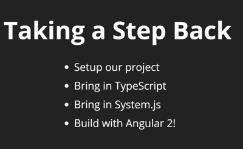
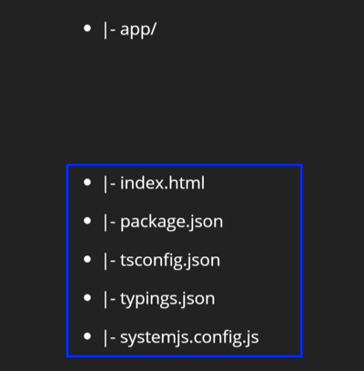
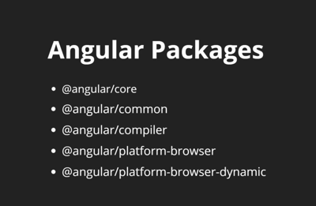
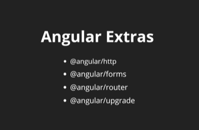

# Angular 2 starter

### The arduous journey to rockin’ an ng2 environment
By the end of this configuration, we will have a working angular2 environment. From now on we can use it as a template for future applications by simply copying the config and index.html files
- package.json
- systemjs.config.js
- tsconfig.json
- typings.json
- index.html`

Then run `npm install`  and we'll be ready to roll.
You can snag the code for these config files at the [Angular 2 website here](https://angular.io/docs/ts/latest/quickstart.html) if need be



<hr>

### Getting Started
First, here are the files get going



<blockquote>
```javascript
npm install
// You should now see node_modules and typings folders. Now start up your project and you're caught up!
npm start
```
</blockquote>

<hr>

### Angular Packages


- These are the things that are on the Angular core and are needed to run our applications
- Angular2 is really keeping it as modular as possible so that it can be deployed on any device and with minimal size

<blockquote>
```javascript
npm install @angular/core @angular/common @angular/compiler @angular/platform-browser @angular/platform-browser-dynamic --save
// and some optional but recommended Packages
npm install @angular/http @angular/forms @angular/router @angular/upgrade --save
```
</blockquote>
- We will install **systemjs** to load in all these packages.
	- this is a loader that will allow us to load modules into different files like in ES6
	- since most browsers don't support modules (without Babel), we let **systemjs** do the same job
	- ex: `import {component} from '@angular/core';`
	- an ES6 module import that is not suppported by browsers yet.
	- There's a lot of code for this systemjs' config file, so it's better to just grab the code from the angular team and create a systemjs.config.js file on the root of the project.

<hr>

### Angular Extras:

These helper modules are included in just about every Angular2 project

<hr>

### You can see how easy it was for us to take the congig files mentioned above, move them to the ng2-start-test directory, run `npm install`, and have a completley configured, ready to go Angular2 env.
